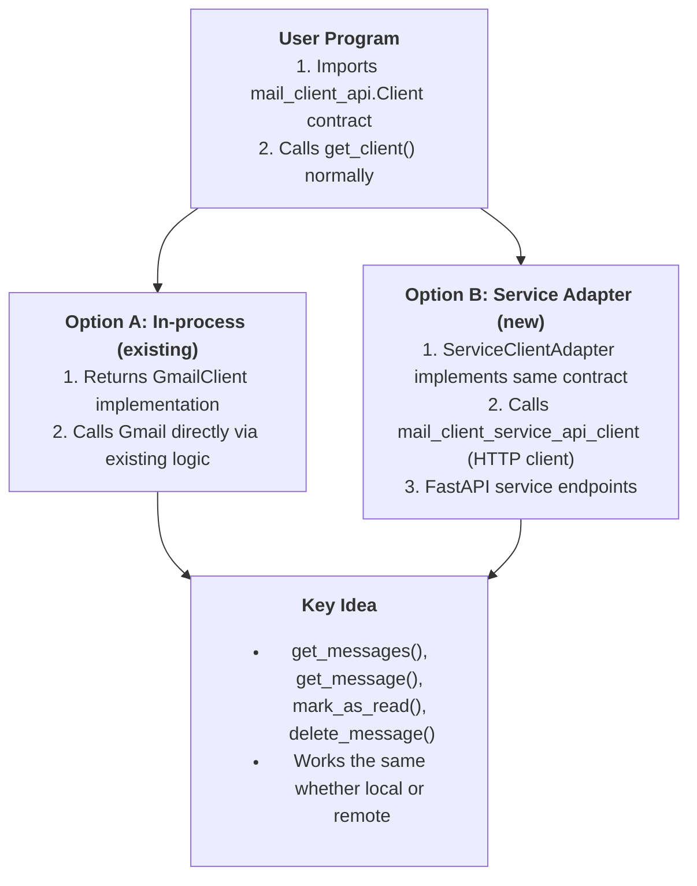

# Design Document — Mail Client Service

This document describes the architecture and design of the service-based changes added in this repository. It covers the FastAPI service, the auto-generated API client, and the adapter that allows user code to consume the service with the same interface as the original library.

## Architecture Overview

- `mail_client_service` (FastAPI service): wraps the existing library implementation and exposes it over HTTP.
- mail_client_service_api_client (auto-generated client): OpenAPI/HTTP client that communicates with the FastAPI service.
- `service_client_adapter` (adapter/shim): implements `mail_client_api.Client` by delegating to the generated client so user code does not have to change.
- `gmail_client_impl` / `mail_client_api` (existing library code): the original in-process client and message implementations.

**High-Level Design**



**Key idea**: user code calls the same methods (get_messages, get_message, mark_as_read, delete_message) regardless of whether the implementation is local or remote.

## Components Added

- **mail_client_service** (`src/mail_client_service/src/mail_client_service/main.py`)

  - FastAPI app exposing endpoints:
    - `GET /` — welcome
    - `GET /login` — authenticate (stores client instance in app.state)
    - `GET /logout` — clears stored client
    - `GET /messages` — list messages
    - `GET /messages/{id}` — message detail
    - `POST /messages/{id}/mark-as-read` — mark message read
    - `DELETE /messages/{id}` — delete message
  - The service re-uses `mail_client_api.get_client` to instantiate the underlying implementation (gmail_client_impl) during /login.
  - Error mapping: service maps underlying exceptions to HTTP status codes (401/404/400/403/500 etc.) — see API Design.

- **mail_client_service_api_client** (`src/mail_client_service_api_client/...`)

  - Auto-generated client using httpx.
  - Provides sync/async convenience functions for each endpoint, returning deserialized JSON or raising when unexpected status codes occur (depending on Client configuration).

- **service_client_adapter** (`src/service_client_adapter/src/service_client_adapter/main.py`)
  - `ServiceClientAdapter` implements `mail_client_api.Client` by delegating to the generated client functions.
  - Provides methods: login(), get_message(message_id), delete_message(message_id), mark_as_read(message_id), get_messages(max_results)
  - Internally creates an instance of generated `Client(base_url="http://127.0.0.1:8000")` (adjustable for different hosts).

## Example Request Flow (one complete request)

**Scenario:** user code calls  
`Client.get_messages(max_results=5)` through the adapter.

---

1. **User code obtains a client**

   - Either via `mail_client_api.get_client()`
   - Or by creating a new instance: `ServiceClientAdapter()`

2. **Adapter call**

   - `ServiceClientAdapter.get_messages()` →  
     calls
     ```python
     mail_client_service_api_client.api.messages.get_messages.sync_detailed(
         client=self.Client,
         max_results=3
     )
     ```

3. **HTTP request**

   - `httpx` sends
     ```
     GET http://127.0.0.1:8000/messages?max_results=3
     ```
     to the FastAPI server.

4. **FastAPI endpoint `/messages` executes:**

   - Checks `app.state.client` for an authenticated client (set by `/login`)
   - Calls:
     ```python
     app.state.client.get_messages(max_results=...)
     ```
     → this is the in-process **Gmail client instance**
   - Serializes each `Message` object into JSON:
     ```json
     {
       "id": "...",
       "from": "...",
       "to": "...",
       "date": "...",
       "subject": "...",
       "body": "..."
     }
     ```
   - Returns:
     ```json
     {
       "messages": [...],
       "status": "success"
     }
     ```

5. **Response handling**

   - The generated client returns the raw JSON (or parsed object) to the adapter.

6. **Adapter conversion**
   - `ServiceClientAdapter` converts the returned JSON into the expected Python shapes (list/dicts).
   - It **yields** them as the iterator result to the consumer.

<u>Note</u>: In this repo the adapter returns plain dictionaries for messages (matching the serialized shape), which is compatible with tests and the mail_client_api.Message contract as used by consumers in these exercises.

## Sample API Response

Below is an actual JSON sample returned by the `/messages` endpoint (constructed from the code's serializer):

```json
{
  "messages": [
    {
      "id": "msg_1",
      "from": "alice@example.com",
      "to": "bob@example.com",
      "date": "10/03/2025",
      "subject": "Hello",
      "body": "Test body"
    }
  ],
  "status": "success"
}
```

And for a single message `GET/messages/{id}`:

```json
{
  "message": {
    "id": "msg_1",
    "from": "alice@example.com",
    "to": "bob@example.com",
    "date": "10/03/2025",
    "subject": "Hello",
    "body": "Test body"
  },
  "status": "success"
}
```

Error example (not authenticated):

```json
{
  "detail": {
    "error": "Not authenticated",
    "message": "User is not authenticated. Please log in first.",
    "status": "error"
  }
}
```

## API Design

**Endpoints:**

- `GET/`

  - Response: 200 {"message":"Welcome to Mail Client Service!"}

- `GET/login?interactive={bool}`

  - Purpose: create/obtain the in-process client (wraps mail_client_api.get_client)
  - Success: 200 {"message":"Authentication successful","status":"success"}
  - Already authenticated: 200 {"message":"Already authenticated","status":"success"}
  - Errors:
    - 401 if credentials not found
    - 400 for interactive auth failures
    - 404 if credentials.json missing
    - 429 if auth already in progress (rate-limited)

- `GET/logout`

  - Purpose: remove stored client from server state
  - Success: 200 {"message":"Logged out successfully","status":"success"}

- `GET/messages?max_results={int}`

  - Query: max_results (int, 1..100, default=3)
  - Success: 200 {"messages": [ {id, from, to, date, subject, body}, ... ], "status":"success" }
  - Errors:
    - 401 if not authenticated
    - 422 for query validation (FastAPI handles this)
    - 500 for unexpected server errors

- `GET/messages/{message_id}`

  - Path: message_id (str)
  - Success: 200 {"message": {id, from, to, date, subject, body}, "status":"success"}
  - Errors:
    - 401 if not authenticated
    - 404 if message not found
    - 400/403 when underlying Gmail API reports 400/403
    - 500 for other errors

- `POST/messages/{message_id}/mark-as-read`

  - Success: 200 {"message": "Message {id} marked as read.", "status": "success"}
  - Errors: same mapping as GET /messages/{id}`

- `DELETE/messages/{message_id}`
  - Success: 200 {"message": "Message {id} deleted successfully.", "status": "success"}
  - Errors: same mapping as GET /messages/{id}

**Error handling strategy:**

- The service maps known underlying errors to appropriate HTTP status codes. For example:
  - Authentication issues -> 401 Unauthorized
  - Missing credentials file -> 404 Not Found
  - Interactive auth failures -> 400 Bad Request
  - Not found errors surfaced from Gmail -> 404 Not Found
  - Gmail HttpError 400/403 -> 400/403 respectively
  - Any other/unexpected exceptions -> 500 Internal Server Error

The test suite in `src/mail_client_service/tests/` validates these mappings by raising Exceptions with marker strings and asserting the resulting HTTP response codes.

## Adapter Pattern

The auto-generated client is a thin HTTP wrapper — it returns JSON payloads (or parsed models) shaped after the OpenAPI spec. The `mail_client_api.Client` interface expects Python callables that return `Message` objects or iterators of `Message` objects and booleans for mutation methods. Without an adapter the generated client would require consumers to:

- call HTTP methods directly
- parse JSON into Message objects
- handle HTTP errors and map them back to the client contract

This breaks the promise that user code should be identical whether using the library or the service.

**How the adapter works (code snippet)**

Below is an example of user code calling the adapter — it looks identical to calling the original library client:

```python
from service_client_adapter.main import ServiceClientAdapter

client = ServiceClientAdapter()
client.login()  # authenticates the service (calls /login)
for msg in client.get_messages(max_results=5):
    print(msg["subject"])  # adapter returns message dict compatible with the serialized shape

msg = client.get_message("abc-123")
client.mark_as_read("abc-123")
client.delete_message("abc-123")
```

**Adapter internals:**

- The adapter composes an auto-generated `Client(base_url=...)` instance.
- Each adapter method calls the corresponding generated function (e.g., `get_messages.sync_detailed`) and adapts the returned `Response`/JSON into the types the user expects.

<u>Note on interface compatibility</u>: In this homework the adapter returns serializable dict objects for messages (rather than concrete `Message` subclass instances). This is sufficient for the tests and keeps the adapter simple. If stricter type-contract compliance is required, the adapter can construct `mail_client_api.message.get_message(...)` instances or concrete implementations that satisfy the `Message` ABC.

## Testing Strategy

**What was tested**

- Unit-style tests around the `mail_client_service` FastAPI app using `fastapi.testclient.TestClient` and monkeypatching `mail_client_api.get_client` to avoid real Google API calls.
- Adapter tests patch the generated API functions (sync_detailed) so no real HTTP requests are sent. These validate that the adapter delegates correctly and respects parameters like `max_results`.
- Contract tests for the abstract `Client` to demonstrate expected behavior of implementations.

**Test types**

- Integration-like tests for the FastAPI endpoints (these run in-process using TestClient). They exercise the full path from HTTP request to the underlying library surface but stub out heavy dependencies.

**Mocking strategy**

- `mail_client_service` tests monkeypatch `mail_client_api.get_client` to return a simple fake client (a SimpleNamespace) with the minimal methods the service calls. This prevents importing `gmail_client_impl` and avoids Google API dependencies during tests.
- `service_client_adapter` tests monkeypatch the generated client functions (`get_messages`, `get_message`, `delete_message`, `mark_message_as_read`, `login`) to return deterministic sentinel values. This prevents real HTTP calls and focuses tests on adapter logic only.
- Contract tests use `unittest.mock.Mock` to create objects that satisfy abstract interfaces (`mail_client_api.Client`, `mail_client_api.Message`) to validate expected calling patterns.

The real Gmail client depends on google-auth and network access; tests for the service should not require network access or credentials. Monkeypatching at the `mail_client_api.get_client` boundary provides a minimal and robust isolation point.

I**nterface complian**ce

- The repository contains tests that validate the `Client` contract via mocks (see `src/mail_client_service/tests/test_client_contract.py`) and adapter tests that ensure adapter methods forward the right parameters to generated API functions.
- For stronger compliance the adapter can be extended to transform JSON response objects into concrete `Message` instances (by using `mail_client_api.message.get_message` factory). That was left intentionally simple for the homework and the provided tests pass with the current approach.
